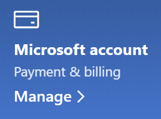

# Mengubah informasi akun Microsoft sayaChange my Microsoft account information

Buka [https://account.microsoft.com](https://account.microsoft.com/) dan masuk jika diperlukan.Go to [https://account.microsoft.com](https://account.microsoft.com/) and sign in if necessary. Hal ini akan mengarahkan Anda ke dasbor akun.This will take you to your account dashboard.  

**Mengedit nama dan informasi pribadi saya****Edit my name and personal information**

1. Di dasbor akun, di samping nama dan gambar akun, klik **Tindakan lainnya > Edit profil**.On your account dashboard, next to your account picture and name, click **More actions > Edit profile**.
2. Di halaman **Edit profil**, gunakan tautan yang disediakan untuk mengubah gambar profil, nama, tanggal lahir, lokasi, dan preferensi bahasa tampilan.On the **Edit profile** page, use the links provided to change your profile picture, name, date of birth, location, and display language preference. Perhatikan tautan ke profil akun Xbox atau Skype Anda, tempat Anda dapat mengubah detail khusus untuk akun ini.Note the links to your Xbox or Skype account profiles, where you can change details specific to these accounts.

**Mengelola alamat email dan nomor telepon****Manage e-mail addresses and phone numbers**

Akun Microsoft memiliki satu atau beberapa alamat email atau nomor telepon yang terkait dengannya sebagai "alias."A Microsoft account has one or more e-mail addresses or phone numbers associated with it as “aliases.” Untuk mengelola perangkat ini:To manage these:

1. Di dasbor akun, di samping nama dan gambar akun, klik **Tindakan lainnya > Edit profil**.On your account dashboard, next to your account picture and name, click **More actions > Edit profile**.
2. Di halaman **Edit profil**, klik **Kelola cara Anda masuk ke Microsoft**.On the **Edit profile** page, click **Manage how you sign in to Microsoft**. 
3. Anda akan melihat daftar alias akun, dan Anda dapat mengelola daftar tersebut, termasuk menambahkan dan menghapus alamat email dan nomor telepon.You will see a list of account aliases, and you can manage the list, including adding and deleting e-mail addresses and phone numbers. Di sini, Anda juga dapat memilih alias yang dapat digunakan untuk masuk ke akun, dan alias yang dianggap "utama," yang akan ditampilkan di perangkat Windows 10.Here you can also select which aliases can be used to sign in to the account, and which alias is considered “primary,” which will be displayed on your Windows 10 devices.

**Mengelola metode pembayaran, serta nama dan alamat untuk penagihan****Manage payment methods, as well as name and address for billing** 

1. Di dasbor akun, di samping nama dan gambar akun, klik **Tindakan lainnya > Edit profil**.On your account dashboard, next to your account picture and name, click **More actions > Edit profile**.
2. Di **Pembayaran & penagihan** klik **Kelola**.Under **Payment & billing** click **Manage**.

    

3. Di sini Anda dapat menambahkan, mengedit, dan menghapus metode pembayaran serta alamat penagihan terkait.Here you can add, edit, and remove payment methods and their associated billing addresses. 
