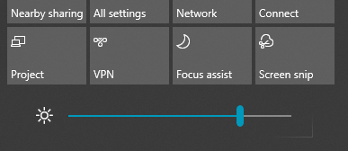

# Mengubah kecerahan layar di Windows 10

Jika Windows 10 Anda lebih baru dari versi 1903, Windows 10 memiliki **penggeser Kecerahan** di pusat tindakan. Untuk membuka pusat tindakan, klik tombol **Pemberitahuan** di sisi paling kanan taskbar, atau tekan **Windows home + A** di keyboard Anda.

Jika Windows 10 adalah versi sebelumnya, Anda dapat menemukan penggeser kecerahan dengan membuka **[Pengaturan > Sistem > Tampilan](ms-settings:display?activationSource=GetHelp)**.

**Catatan**:

- Anda mungkin tidak melihat tombol Ubah kecerahan di penggeser tampilan bawaan pada PC desktop yang memiliki monitor eksternal. Untuk mengubah kecerahan monitor eksternal, gunakan kontrol pada monitor.
- Jika Tidak memiliki PC desktop dan penggeser tidak muncul atau berfungsi, coba perbarui driver tampilan. Dalam kotak pencarian di taskbar, ketik **Pengelola Perangkat**, lalu pilih **Pengelola Perangkat** dari daftar hasil. Di **Pengelola Perangkat**, pilih **Adaptor tampilan**, lalu pilih adaptor tampilan. Tekan dan tahan (atau klik kanan) nama adaptor tampilan dan klik **Perbarui driver**; lalu ikuti petunjuknya.
