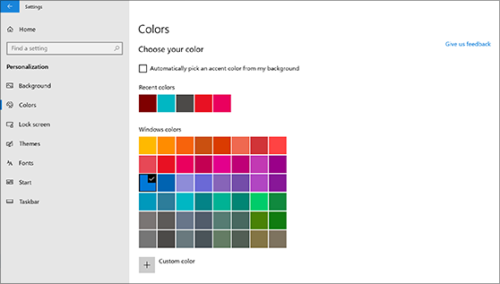
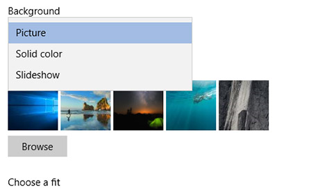

# Mengubah latar belakang dan warna desktop Anda

Untuk mengubah pengaturan warna Anda, buka Mulai Pengaturan Warna Personalisasi , lalu pilih warna Anda sendiri atau biarkan Windows mengambil warna aksen  >    >    >  dari latar belakang Anda.

Untuk mengubah latar belakang desktop, buka Mulai Pengaturan Personalisasi Latar Belakang , lalu pilih gambar, warna solid, atau buat  >    >    >  peragaan slide gambar. 

Ingin latar belakang dan warna desktop lainnya? Kunjungi [Microsoft Store](https://www.microsoft.com/store/collections/windowsthemes) untuk memilih dari berbagai tema gratis.
