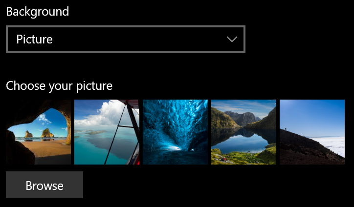
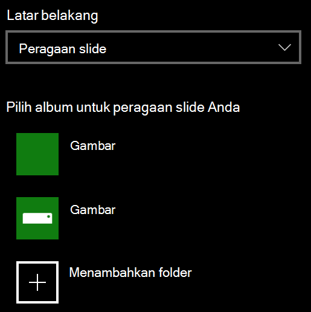

# Mengubah latar belakang layar penguncian Anda

- Masuk ke **Layar**  >  **Kunci Personalisasi**  >  **Pengaturan**. Atau klik atau ketuk di [sini](ms-settings:lockscreen?activationSource=GetHelp).

- Untuk mengatur gambar latar belakang kustom, **pilih Gambar** **dari daftar** turun bawah Latar belakang, dan pilih **atau** Telusuri gambar.

  

- Untuk menyiapkan peragaan slide  gambar kustom, pilih Peragaan Slide dari daftar turun bawah Latar Belakang, dan pilih album atau tambahkan folder yang berisi gambar untuk peragaan slide. 

  
