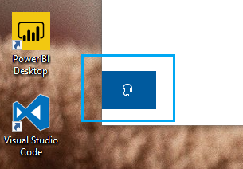

# Hubungi kami dengan mengklik tombol headphoneContact us by clicking the headphone button

Jika Anda ingin menghubungi dukungan Microsoft, silakan klik **hubungi kami** di sudut kiri bawah aplikasi ini.If you'd like to contact Microsoft Support, please click **Contact us** in the lower left corner of this app. Di dalam jendela Fly-Out, Anda akan dipandu ke saluran dukungan yang tepat setelah memilih kategori produk dan masalah.Inside the fly-out window, you will be guided to the right support channel after choosing your product and issue category.

Anda dapat terus berinteraksi dengan aplikasi lainnya, bahkan setelah Anda memulai sesi hubungi kami.You can keep interacting with the rest of the app even after you have initiated a Contact us session. Panel hubungi kami dapat diminimalkan sementara dengan mengeklik di mana pun di dalam aplikasi.The Contact us panel can be temporarily minimized by clicking anywhere else inside the app. Untuk kembali ke sesi yang sama, cukup klik **hubungi kami** lagi.To return to the same session, just click **Contact us** again.
