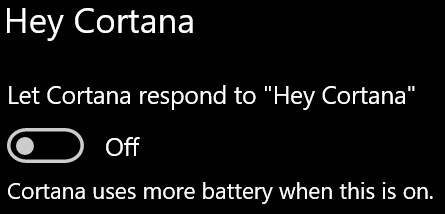

# Cortana tidak berbicara dengan saya atau tidak dapat mendengar saya

Jika Anda mencoba untuk menggunakan "Hey Cortana" fitur, yang memungkinkan Anda untuk berbicara dengan Cortana tanpa memilih tombol Cortana pada taskbar atau tombol mikrofon di panel Cortana, mengkonfirmasi bahwa fitur ini diaktifkan:

1. Buka **mulai**, lalu pilih **[pengaturan > Cortana](ms-settings:cortana?activationSource=GetHelp)**.
2. Di bawah **Hey cortana**, beralih **membiarkan Cortana menanggapi "Hey cortana"** beralih ke **on**.

**Apakah pengaturan privasi Anda mencegah Cortana mendengar Anda?**

Pengaturan privasi Anda dapat mencegah Cortana merespons suara Anda.
- Periksa untuk memastikan pengenalan ucapan online diaktifkan:
    - Buka **mulai**, lalu klik **[setelan > privasi > ucapan](ms-settings:privacy-speech?activationSource=GetHelp)**.
    - Di bawah **pengenalan ucapan online**, alihkan setelan ke **aktif**.
- Periksa untuk memastikan Cortana memiliki izin untuk mengakses mikrofon Anda. 
    - Buka mulai, lalu klik **[pengaturan > privasi > mikrofon](ms-settings:privacy-microphone?activationSource=GetHelp)**.
    - Di bawah **pilih aplikasi mana yang dapat mengakses mikrofon Anda**, Cari **Cortana** dalam daftar aplikasi dan layanan dan pastikan pengalih beralih ke **aktif**.

Selain itu, Harap juga pastikan bahwa speaker atau mikrofon Anda dan bekerja untuk berbicara dengan Cortana.
