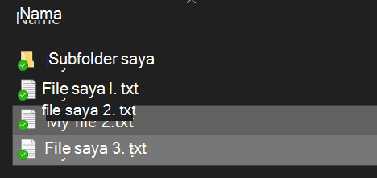
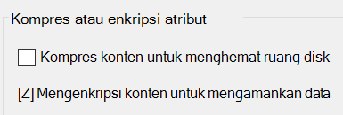

# Mengenkripsi file atau folder di Windows 10

Anda dapat mengenkripsi seluruh disk menggunakan BitLocker, tetapi untuk mengenkripsi hanya file atau folder individual (dan isinya):

1. Di **File Explorer**, pilih file/folder yang ingin Anda enkripsi. Dalam contoh ini, dua file telah dipilih:

    

2. Klik kanan file yang dipilih dan klik **Properti**.

3. Dalam jendela **Properti**, klik **Lanjutan**.

4. Di jendela **Properti Lanjutan**, centang kotak **Enkripsi konten untuk mengamankan data**:

    

5. Klik **OK**.
