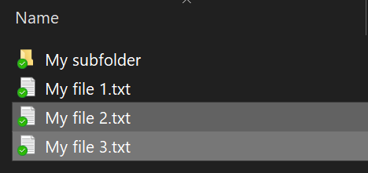
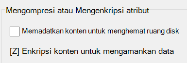

# Mengenkripsi file atau folder di Windows 10Encrypt files or folder in Windows 10

Anda dapat mengenkripsi seluruh disk menggunakan BitLocker, tetapi untuk mengenkripsi hanya file atau folder individual (dan isinya):You can encrypt an entire disk using BitLocker, but to encrypt only individual files or folders (and their contents):

1. Di **File Explorer**, pilih file/folder yang ingin Anda enkripsi.In **File Explorer**, select the file(s)/folder(s) you want to encrypt. Dalam contoh ini, dua file telah dipilih:In this example, two files have been selected:

    

2. Klik kanan file yang dipilih dan klik **Properti**.Right-click the selected files and click **Properties**.

3. Dalam jendela **Properti**, klik **Lanjutan**.In the **Properties** window, click **Advanced**.

4. Di jendela **Properti Lanjutan**, centang kotak **Enkripsi konten untuk mengamankan data**:In the **Advanced Properties** window, select the **Encrypt contents to secure data** checkbox:

    

5. Klik **OK**.Click **OK**.
