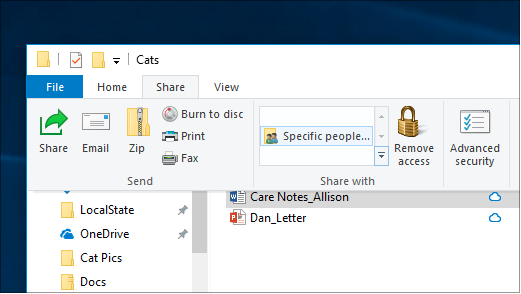

# Berbagi file melalui jaringan di Windows 10

**Catatan**: jika sebelumnya Anda menggunakan homegroup untuk berbagi file, harap perhatikan bahwa homegroup telah dihapus dari Windows 10 (versi 1803). Kini Anda dapat berbagi printer dan file dengan menggunakan fitur bawaan di Windows 10.

**Untuk berbagi file atau folder melalui jaringan**

- Di **file Explorer**, pilih file > klik tab **bagikan** di bagian > atas di bagian **berbagi dengan** , klik **orang tertentu**.

    
          
- Jika Anda memilih beberapa file sekaligus, Anda bisa membagikannya dengan cara yang sama. Juga berfungsi untuk folder.

**Untuk melihat perangkat pada jaringan yang berbagi file**

- Di **file Explorer**, masuk ke **jaringan**. Jika penemuan jaringan tidak diaktifkan, Anda akan melihat pesan kesalahan "penemuan jaringan dimatikan..."

- Klik **penemuan jaringan** dinonaktifkan banner, lalu klik **Aktifkan penemuan jaringan dan berbagi file**.

    

[Baca selengkapnya tentang berbagi file melalui jaringan](https://support.microsoft.com/help/4092694/windows-10-file-sharing-over-a-network)

[Berbagi file menggunakan aplikasi, OneDrive, email, dan lainnya](https://support.microsoft.com/help/4027674/windows-10-share-files-in-file-explorer)
