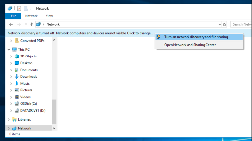

# Berbagi berkas melalui jaringan di Windows 10File sharing over a network in Windows 10

**Catatan**: jika Anda sebelumnya menggunakan homegroup untuk berbagi file, Harap dicatat bahwa homegroup telah dihapus dari Windows 10 (versi 1803).**Note**: If you previously used HomeGroup for file sharing, please note that HomeGroup has been removed from Windows 10 (Version 1803). Anda sekarang dapat berbagi printer dan file dengan menggunakan fitur built-in di Windows 10.You can now share printers and files by using built-in features in Windows 10.

**Untuk berbagi file atau folder melalui jaringan****To share files or folders over a network**

- Di **file Explorer**, pilih file > klik tab **berbagi** di > atas di bagian **berbagi dengan** , klik **orang tertentu**.In **File Explorer**, select a file > click the **Share** tab at the top > in the **Share with** section, click **Specific people**.

    
          
- Jika Anda memilih beberapa file sekaligus, Anda dapat membagikannya semua dengan cara yang sama.If you select multiple files at once, you can share them all in the same way. Ia juga bekerja untuk folder.It works for folders, too.

**Untuk melihat perangkat di jaringan yang berbagi file****To see devices on the network that are sharing files**

- Di **file Explorer**, buka **jaringan**.In **File Explorer**, go to **Network**. Jika penemuan jaringan tidak diaktifkan, Anda akan melihat pesan galat "penemuan jaringan dimatikan..."If Network discovery is not enabled, you will see an error message "Network discovery is turned off..."

- Klik **penemuan jaringan** dimatikan banner, lalu klik **nyalakan penemuan jaringan dan berbagi file**.Click the **Network discovery is turned off** banner, then click **Turn on network discovery and file sharing**.

    

[Baca selengkapnya tentang berbagi file melalui jaringanRead more about file sharing over a network](https://support.microsoft.com/help/4092694/windows-10-file-sharing-over-a-network)

[Berbagi file menggunakan aplikasi, OneDrive, email, dan lainnyaShare files using apps, OneDrive, emails, and more](https://support.microsoft.com/help/4027674/windows-10-share-files-in-file-explorer)
