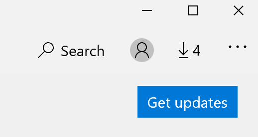

# Memperbaiki bahasa tampilan aplikasiFix the display language of apps

Setelah Anda mengubah bahasa tampilan di Windows 10, beberapa aplikasi masih dapat menggunakan bahasa sebelumnya saat Anda membukanya.After you change the display language in Windows 10, some apps may still use the previous language when you open them. Hal ini terjadi karena versi baru aplikasi untuk bahasa tersebut harus didownload dari Bursa.This happens because new versions of the apps for that language must be downloaded from the Store. Untuk memperbaiki masalah ini, Anda dapat menunggu pembaruan otomatis, atau Anda dapat secara manual menginstal versi terbaru dari aplikasi.To fix this problem, you can either wait for the automatic update, or you can manually install the updated version of the apps.

Untuk menginstal pemutakhiran secara manual, buka **Microsoft Store** dan klik **unduhan dan pembaruan** di sudut kanan atas.To manually install the update, open **Microsoft Store** and click **Downloads and updates** in the top right corner. Setelah itu, klik **Dapatkan pembaruan**.Then click **Get updates**. Jika bahasa tidak berubah setelah pembaruan selesai, coba nyalakan ulang PC Anda.If the language is not changed after the update is complete, try restarting your PC.

Untuk membaca lebih lanjut tentang pengaturan input dan tampilan bahasa, lihat [mengelola pengaturan input dan tampilan bahasa di Windows 10](https://support.microsoft.com/help/4027670/windows-10-add-and-switch-input-and-display-language-preferences).To read more about input and display language settings, see [Manage your input and display language settings in Windows 10](https://support.microsoft.com/help/4027670/windows-10-add-and-switch-input-and-display-language-preferences).
