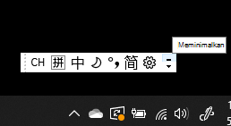
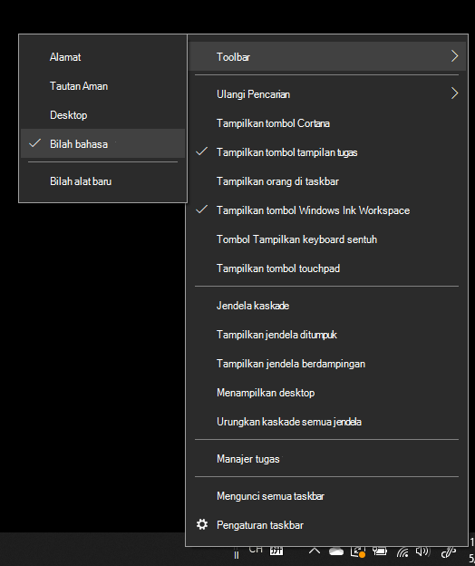
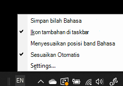

# Sembunyikan, tampilkan, atau atur ulang panel bahasaHide, display, or reset the language bar

**Untuk mengecilkan panel bahasa:****To minimize the language bar:**

Anda dapat mengklik tombol kecilkan di pojok kanan atas panel bahasa.You can click the minimize button on the top right corner of the language bar. Atau, cukup tarik panel bahasa ke taskbar dan panel bahasa akan dikecilkan secara otomatis.Or, you can just drag the language bar to the task bar, which will automatically minimize it.

**Untuk memunculkan panel bahasa:****To pop out the language bar:**

Jika Anda tidak ingin menambatkan panel bahasa di taskbar, klik kanan ruang kosong di taskbar, lalu hapus centang opsi **Panel bahasa** pada menu Toolbar.If you don't want to dock the language bar in the taskbar, right-click any empty space in the taskbar, and uncheck the **Language bar** option in the Toolbars menu. Tindakan ini akan membuat panel bahasa keluar dari taskbar, sama seperti cuplikan layar sebelumnya.This will make the language bar appear outside the taskbar, just like the previous screenshot.

**Untuk memulihkan panel bahasa ke default:****To restore the language bar to default:**

Klik kanan tombol bahasa di toolbar, lalu klik opsi **Pulihkan panel bahasa** pada menu.Right-click the language button in the toolbar, and click **Restore the language bar** option in the menu. Ini akan memulihkannya ke default.This will restore it to default.

