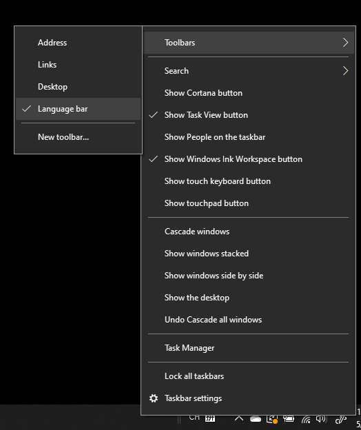

# Sembunyikan, tampilkan, atau atur ulang panel bahasa

**Untuk mengecilkan panel bahasa:**

Anda dapat mengklik tombol kecilkan di pojok kanan atas panel bahasa. Atau, cukup tarik panel bahasa ke taskbar dan panel bahasa akan dikecilkan secara otomatis.

**Untuk memunculkan panel bahasa:**

Jika Anda tidak ingin menambatkan panel bahasa di taskbar, klik kanan ruang kosong di taskbar, lalu hapus centang opsi **Panel bahasa** pada menu Toolbar. Tindakan ini akan membuat panel bahasa keluar dari taskbar, sama seperti cuplikan layar sebelumnya.

**Untuk memulihkan panel bahasa ke default:**

Klik kanan tombol bahasa di toolbar, lalu klik opsi **Pulihkan panel bahasa** pada menu. Ini akan memulihkannya ke default.

