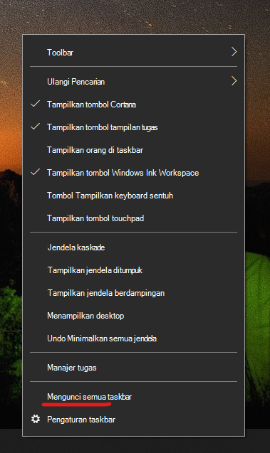

# Memindahkan taskbar ke salah satu sisi atau ke atas desktop AndaMove the taskbar to either side or the top of your desktop

Pertama, pastikan bahwa taskbar tidak terkunci.First, please confirm that the taskbar is unlocked. Untuk mengetahui apakah taskbar Anda tidak terkunci, klik kanan ruang kosong pada taskbar dan lihat apakah terdapat tanda centang di samping menu **Kunci taskbar**.To find out whether yours is unlocked, right-click any empty space on the taskbar and see whether **Lock the taskbar** has a checkmark next to it. Jika ada tanda centang, berarti taskbar dikunci dan tidak dapat dipindahkan.If there is a checkmark, the taskbar is locked and cannot be moved. Mengklik **Kunci taskbar** sekali akan membuka kuncinya dan menghapus tanda centang.Clicking **Lock the taskbar** once will unlock it and remove the checkmark.

Jika Anda memiliki beberapa monitor yang menampilkan taskbar, Anda akan melihat **Kunci semua taskbar**.If you have multiple monitors that display the taskbar, you will see **Lock all taskbars**.

Setelah taskbar tidak terkunci, Anda dapat menekan dan menahan ruang kosong pada taskbar dan menyeretnya ke lokasi yang Anda inginkan di layar.Once the taskbar is unlocked, you can press and hold any empty space on the taskbar and drag it to the location you want on the screen. Anda juga dapat melakukannya dengan mengklik kanan ruang kosong pada taskbar dan membuka **[Pengaturan taskbar](ms-settings:taskbar?activationSource=GetHelp) > Lokasi taskbar di layar**.You can also do so by right-clicking on any empty space on the taskbar and go to **[Taskbar settings](ms-settings:taskbar?activationSource=GetHelp) > Taskbar location on screen**.
