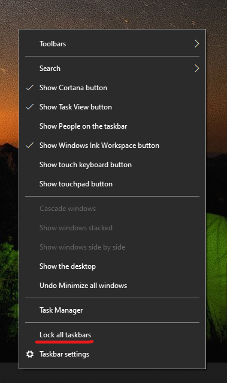

# Memindahkan taskbar ke salah satu sisi atau ke atas desktop Anda

Pertama, pastikan bahwa taskbar tidak terkunci. Untuk mengetahui apakah taskbar Anda tidak terkunci, klik kanan ruang kosong pada taskbar dan lihat apakah terdapat tanda centang di samping menu **Kunci taskbar**. Jika ada tanda centang, berarti taskbar dikunci dan tidak dapat dipindahkan. Mengklik **Kunci taskbar** sekali akan membuka kuncinya dan menghapus tanda centang.

Jika Anda memiliki beberapa monitor yang menampilkan taskbar, Anda akan melihat **Kunci semua taskbar**.

Setelah taskbar tidak terkunci, Anda dapat menekan dan menahan ruang kosong pada taskbar dan menyeretnya ke lokasi yang Anda inginkan di layar. Anda juga dapat melakukannya dengan mengklik kanan ruang kosong pada taskbar dan membuka **[Pengaturan taskbar](ms-settings:taskbar?activationSource=GetHelp) > Lokasi taskbar di layar**.
