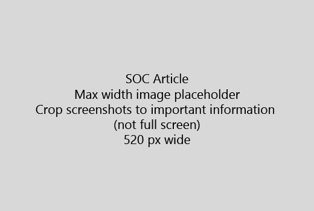

Memulai artikel Anda dengan pengenalan yang sangat singkat (1 kalimat). Tempatkan diri Anda dalam pembaca - mengapa mereka di sini? Apa yang harus mereka lakukan? 
  
1. Mendapatkan langsung ke daftar cepat langkah-langkah untuk menyelesaikan tugas.
    
    Jika Anda perlu untuk menjelaskan sebuah konsep, atau harus mereka lakukan prasyarat langkah-langkah, Tambahkan ringkasan di bawah ini langkah yang mana mereka perlu itu, dan [link](https://support.office.com/article/f37e7984-cf03-4fde-92d3-82970d7e241b.aspx) ke konsep atau langkah-langkah. 
    
2. Menjaga prosedur pendek - langkah sebaiknya 5 atau lebih sedikit, tidak lebih dari 8.
    
3. Menggunakan **Ui gaya** untuk elemen antarmuka pengguna atau teks orang perlu untuk memasukkan. 
    
4. Penggunaan kata kerja memilih, memilih, atau masukkan sebagai tindakan, dan format menu sebagai **Menu** \> **perintah**.
    
5. Opsional, menambah screenshot untuk konteks (jika UI sulit untuk menemukan, atau telah dibutuhkan untuk menyelesaikan tugas).
    
    Lebar maksimum: 520 piksel. Menggunakan tema standar, jangan Tampilkan informasi pribadi, dan tanaman untuk menunjukkan hanya apa yang relevan. 
    
    
  
Jika Anda ingin menambahkan video atau screenshot, menggunakan grid dua kolom dan memiliki langkah-langkah di sebelah kiri dan video atau screenshot di kanan - Lihat [langkah-langkah dan contoh video grid](https://support.office.com/article/14ce8e82-efa0-47f5-bb84-94f078db3dae.aspx). 
  
Sasaran tidak lebih dari 500 kata untuk artikel.
  
# Contoh artikel

[Mengubah foto saya](https://support.office.com/article/555376e0-1fca-49ba-8434-307a0525c767.aspx)
  

