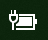

# Ikon daya atau baterai tidak ada di Windows 10Power or battery icon missing in Windows 10

Jika perangkat Windows 10 memiliki baterai (misalnya, laptop atau tablet, atau PC yang disambungkan melalui USB ke UPS), biasanya ikon daya/baterai ditampilkan di taskbar dekat jam, misalnya:If your Windows 10 device has a battery (e.g., laptop or tablet, or a PC connected via USB to a UPS), normally a power/battery icon is shown in the taskbar near the clock, for example:

Jika Anda tidak melihat ikon ini, ikon mungkin tersembunyi:If you don't see this icon, it may be hidden:

1. Masuk ke **[Pengaturan > Personalisasi > Taskbar](ms-settings:taskbar?activationSource=GetHelp)**.Go to **[Settings > Personalization > Taskbar](ms-settings:taskbar?activationSource=GetHelp)**.

2. Di area Pemberitahuan, klik **Pilih ikon yang muncul di taskbar**.In the Notification area, click **Select which icons appear on the taskbar**.

3. Lalu, temukan item **Daya** di daftar dan alihkan pengaturannya ke **Aktif**.Then find the **Power** item in the list and toggle its setting to **On**.

    

**Pemecahan masalah****Troubleshooting**

Jika Anda telah mengikuti instruksi di atas dan tombol alih **Daya** berwarna abu-abu atau tidak terlihat, di kotak pencarian di taskbar, ketik **device manager**, lalu pilih **Device Manager** di daftar hasil.If you followed the above instructions and the **Power** toggle is greyed out or not visible, in the search box on the taskbar, type **device manager**, and then select **Device Manager** in the list of results. Di bawah **Baterai**, klik kanan baterai perangkat Anda, klik **Nonaktifkan**, lalu klik **Ya**.Under **Batteries**, right-click the battery for your device, click **Disable**, and click **Yes**. Tunggu beberapa detik, lalu klik kanan baterai dan klik **Aktifkan**.Wait a few seconds, and then right-click the battery and click **Enable**. Lalu, hidupkan ulang perangkat Anda.Then restart your device.

Jika Anda telah mengikuti instruksi di atas, tetapi ikon baterai tidak muncul di taskbar, di kotak pencarian di taskbar, ketik **manajer tugas**, lalu klik **Manajer Tugas** di daftar hasil.If you followed the above instructions, but the battery icon does not appear on the taskbar, in the search box on the taskbar, type **task manager**, and then click **Task Manager** in the list of results. Di tab **Proses**, di bawah **Nama**, klik kanan **Explorer**, lalu klik **Hidupkan ulang**.On the **Processes** tab, under **Name**, right-click **Explorer**, and then click **Restart**.
