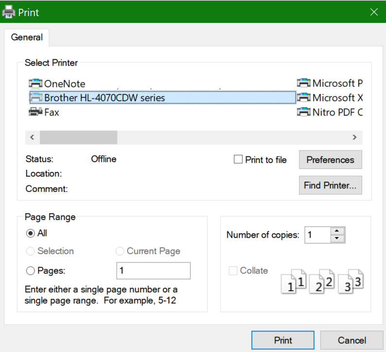

# Mencetak pada kedua sisi kertas (pencetakan dupleks)Printing on both sides of paper (duplex printing)

**Apakah printer saya mampu melakukan pencetakan dupleks?****Is my printer capable of duplex printing?**

Ringkasan fitur atau manual printer Anda akan memberi tahu apakah printer dapat mencetak di kedua sisi kertas, yang juga dikenal sebagai "pencetakan dupleks."Your printer’s feature summary or manual should tell you whether it is capable of printing on both sides of the paper, also known as “duplex printing.” Jika Anda memiliki Microsoft Office, cara lain untuk mencari tahu adalah dengan membuka aplikasi Office seperti Word atau Excel, masuk ke **File > Print**, pastikan printer yang tepat dipilih, dan mencari kapabilitasnya di bagian Pengaturan.If you have Microsoft Office, another way to find out is by opening an Office app like Word or Excel, going to **File > Print**, making sure the right printer is selected, and looking for the capability in the Settings section. Misalnya:For example: 

**Pencetakan dupleks di Microsoft Office****Duplex printing in Microsoft Office**

Jika printer Anda bisa mencetak di kedua sisinya, saat Anda masuk ke **File > Cetak** di aplikasi Office, Anda akan melihat opsi "Cetak di Kedua Sisi," seperti yang diperlihatkan dalam contoh di atas.If your printer is capable of printing on both sides, when you go to **File > Print** in the Office app, you will see an option to “Print on Both Sides,” as shown in the example above.  Pilih tipe pencetakan ganda yang Anda inginkan (balik ke tepi panjang, atau balik di tepi pendek), dan **klik** Cetak untuk memulai hasil cetak.Select the type of duplex printing you want (flip on long edge, or flip on short edge), and click **Print** to start the printout.

**Pencetakan dupleks dari aplikasi apa pun****Duplex printing from any application**

Di banyak aplikasi saat mencetak Anda akan melihat dialog cetak umum yang terlihat seperti ini:In many apps when you print you will see a general print dialog that looks like this: 

Pastikan printer yang tepat dipilih, lalu **klik Preferensi** untuk membuka jendela preferensi printer.Make sure the right printer is selected, then click **Preferences** to open the printer preferences window. Jika printer mampu melakukan pencetakan dupleks, kemampuan untuk mengaktifkannya untuk pekerjaan pencetakan saat ini akan muncul di jendela tersebut.If the printer is capable of duplex printing, the ability to enable this for the current print job will show in that window.
