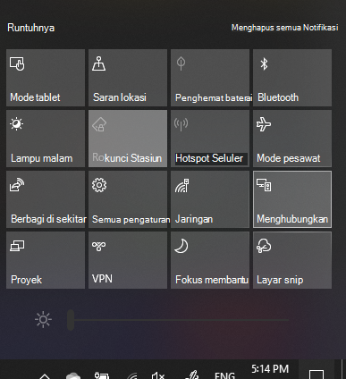

# Memproyeksikan ke PCProject to a PC

Pada perangkat tujuan Anda (memproyeksikan ke), Cari "pengaturan proyeksi" untuk membuka halaman pengaturan **memproyeksikan ke PC ini**.On your destination device (projecting to), search for "Projection Settings" to open the Settings page of **Projecting to this PC**. Kemudian pastikan bahwa:Then make sure that:
- "Beberapa perangkat Windows dan Android bisa memproyeksikan ke PC ini saat Anda bilang itu OK" menu turun bawah diatur untuk **selalu nonaktif**."Some Windows and Android devices can project to this PC when you say it's OK" drop-down menu is set to **Always Off**.
- Menu turun bawah "minta proyek ke PC ini" diatur ke **setiap kali koneksi diperlukan**."Ask to project to this PC" drop-down menu is set to **Every time a connection is required**.
- Menu turun bawah "memerlukan SEMATKAN untuk pairing" diatur ke **tidak pernah**."Require PIN for pairing" drop-down menu is set to **Never**.

Di perangkat tujuan Anda, Luncurkan aplikasi **Sambungkan** dengan masuk ke **mulai** dan Cari "Sambungkan".On your destination device, launch **Connect** app by going to **Start** and search for "Connect".

Lalu, di perangkat sumber Anda yang sedang mencoba memproyeksikan:Then, on your source device that you are trying to project from:

1. Tekan **tombol Windows + A** untuk membuka pusat tindakan.Press **Windows key + A** to open Action Center.
2. Klik **Sambungkan**.Click **Connect**.
3. Klik perangkat tempat Anda ingin memproyeksikan layar.Click the device you want to project the screen to.

Setelah langkah di atas, perangkat tujuan Anda harus menampilkan layar perangkat sumber seolah-olah merupakan monitor sekunder.After the above steps, your destination device should display the screen of the source device as if it is a secondary monitor.
