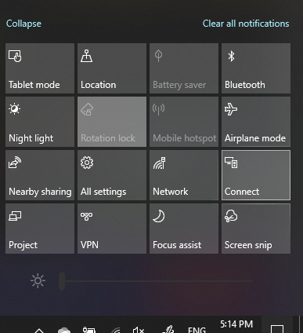

# Project ke PC

Pada perangkat tujuan Anda (memproyeksikan ke), cari "Proyeksi Pengaturan" untuk membuka Pengaturan proyeksi **ke PC ini.** Lalu pastikan bahwa:
- Menu menurun "Windows dan Android dapat diproyeksikan ke PC ini jika Anda mengatakan tidak apa-apa" diatur ke **Selalu Nonaktif.**
- Menu turun bawah "Minta untuk memproyeksikan ke PC ini" **disetel ke Setiap kali koneksi diperlukan.**
- Menu turun bawah "Perlu PIN untuk memasangkan" diatur ke **Jangan Pernah**.

Di perangkat tujuan, **luncurkan Koneksi** dengan masuk ke **Mulai,** lalu cari "Koneksi".

Lalu, di perangkat sumber tempat Anda mencoba memproyeksikan:

1. Tekan **Windows + A** untuk membuka Pusat Tindakan.
2. Klik **Koneksi**.
3. Klik perangkat yang Anda inginkan untuk memproyeksikan layar.

Setelah langkah-langkah di atas, perangkat tujuan Anda akan menampilkan layar perangkat sumber seperti monitor sekunder.
