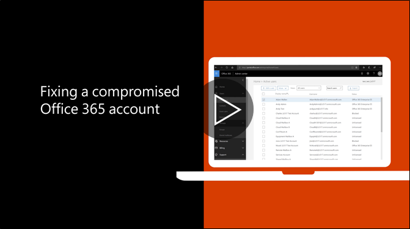

# Langkah-langkah yang direkomendasikan untuk mengambil jika account terganggu

  
1. [Reset password pengguna](https://support.office.com/article/7a5d073b-7fae-4aa5-8f96-9ecd041aba9c) segera. Tidak berkomunikasi sandi baru melalui email kepada pengguna akhir. 
    
2. Menghapus setiap mencurigakan [forwarding alamat](https://support.office.com/article/ab5eb117-0f22-4fa7-a662-3a6bdb0add74) ditetapkan pada tingkat kotak pesan. 
    
3. Menghapus mencurigakan [aturan kotak masuk](https://support.office.com/article/1433E3A0-7FB0-4999-B536-50E05CB67FED) berada di dalam kotak. 
    
4. Jika pengguna diblokir dari mengirim email, [pergi ke pengguna dibatasi untuk membatalkan pemblokiran account](https://protection.office.com/?hash=/restrictedusers). Setelah selesai, pengguna harus dapat melanjutkan mengirim pesan dalam waktu 1 jam.
    
5. Menghapus account pengguna dari setiap [grup peran administratif](https://support.office.com/article/eac4d046-1afd-4f1a-85fc-8219c79e1504) sampai Anda yakin bahwa akun tidak lagi terganggu. 
    
Untuk meminimalkan potensi data pelanggaran atau account dikompromikan di masa depan, kami sarankan membaca [artikel praktik terbaik kantor 365 keamanan](https://support.office.com/article/9295e396-e53d-49b9-ae9b-0b5828cdedc3)kami.
  

