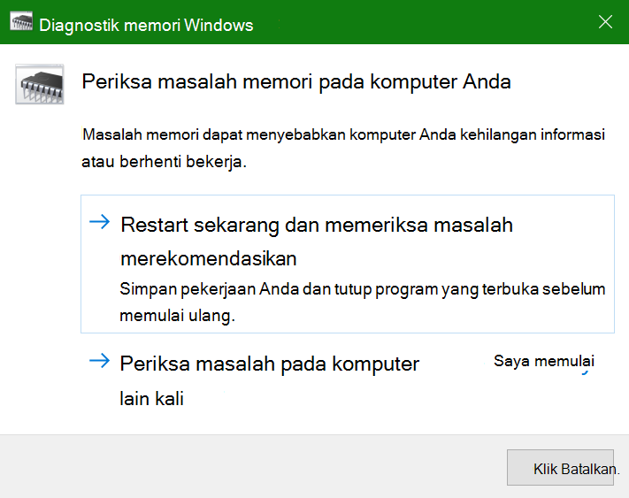
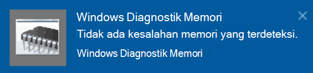

# Menjalankan Diagnostik Memori Windows di Windows 10

Jika Windows dan aplikasi di PC Anda mengalami crash, berhenti berfungsi, atau bekerja secara tidak stabil, Anda mungkin mengalami masalah dengan memori (RAM) PC. Anda dapat menjalankan Diagnostik Memori Windows untuk memeriksa masalah RAM PC.

Dalam kotak pencarian di taskbar Anda, ketik **diagnostik memori**, lalu pilih Diagnostik **Memori Windows**. 

Untuk menjalankan diagnostik, PC harus dihidupkan ulang. Anda memiliki opsi untuk segera memulai ulang (silakan simpan pekerjaan dan tutup dokumen serta email yang terbuka terlebih dahulu), atau jadwalkan diagnostik untuk berjalan secara otomatis saat PC dimulai ulang di lain waktu:

Saat PC dihidupkan ulang, Alat **Diagnostik Memori Windows akan** berjalan secara otomatis. Status dan kemajuan akan ditampilkan saat diagnostik berjalan, dan Anda memiliki opsi untuk membatalkan diagnostik dengan menekan **tombol ESC** di keyboard Anda.

Ketika diagnostik selesai, Windows akan dimulai secara normal.
Segera setelah mulai ulang, saat Desktop muncul, pemberitahuan  akan muncul (di samping ikon Pusat Tindakan di taskbar), untuk menunjukkan apakah ada kesalahan memori yang ditemukan. Misalnya:

Berikut ikon Pusat Tindakan:  

Dan pemberitahuan sampel: 

Jika Anda melewatkan pemberitahuan, Anda bisa memilih ikon **Pusat** Tindakan pada taskbar untuk menampilkan Pusat **Tindakan** dan melihat daftar pemberitahuan yang bisa digulir.

Untuk meninjau informasi mendetail, ketikkan **acara** ke dalam kotak pencarian di taskbar, lalu pilih **Penampil Kejadian**. Di panel **kiri Penampil** Kejadian, navigasikan ke Log Windows **> Sistem.** Di panel sebelah kanan, pindai daftar sambil  melihat kolom Sumber, hingga Anda melihat kejadian dengan nilai Sumber **MemoriDiagnostics-Hasil.** Sorot setiap kejadian tersebut dan lihat informasi hasilnya dalam kotak di bawah tab **Umum** di bawah daftar tersebut.
