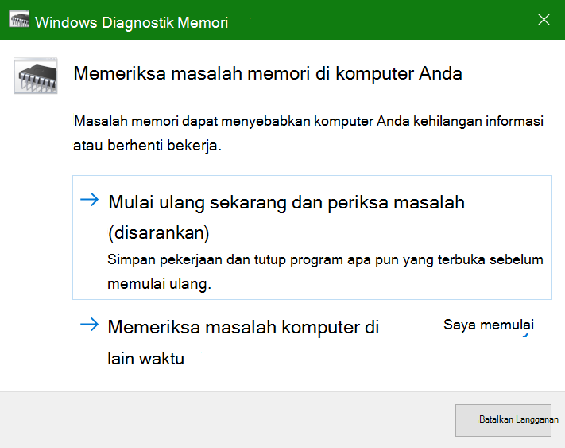

# Menjalankan Diagnostik Memori Windows di Windows 10Run Windows Memory Diagnostics in Windows 10

Jika Windows dan aplikasi di PC Anda mengalami crash, berhenti berfungsi, atau bekerja secara tidak stabil, Anda mungkin mengalami masalah dengan memori (RAM) PC.If Windows and apps on your PC are crashing, freezing, or acting in an unstable manner, you may have a problem with the PC’s memory (RAM). Anda dapat menjalankan Diagnostik Memori Windows untuk memeriksa masalah RAM PC.You can run the Windows Memory Diagnostic to check for problems with the PC’s RAM.

Dalam kotak pencarian di taskbar Anda, ketik **diagnostik memori**, lalu pilih Diagnostik **Memori Windows**.In the search box on your taskbar, type **memory diagnostic**, and then select **Windows Memory Diagnostic**. 

Untuk menjalankan diagnostik, PC harus dihidupkan ulang.To run the diagnostic, the PC needs to restart. Anda memiliki opsi untuk segera memulai ulang (silakan simpan pekerjaan dan tutup dokumen serta email yang terbuka terlebih dahulu), atau jadwalkan diagnostik untuk berjalan secara otomatis saat PC dimulai ulang di lain waktu:You have the option to restart immediately (please save your work and close open documents and e-mails first), or schedule the diagnostic to run automatically the next time the PC restarts:

Saat PC dihidupkan ulang, Alat **Diagnostik Memori Windows akan** berjalan secara otomatis.When the PC restarts, the **Windows Memory Diagnostics Tool** will run automatically. Status dan kemajuan akan ditampilkan saat diagnostik berjalan, dan Anda memiliki opsi untuk membatalkan diagnostik dengan menekan **tombol ESC** di keyboard Anda.Status and progress will be displayed as the diagnostics run, and you have the option of cancelling the diagnostics by hitting the **ESC** key on your keyboard.

Ketika diagnostik selesai, Windows akan dimulai secara normal.When the diagnostics are complete, Windows will start normally.
Segera setelah mulai ulang, saat Desktop muncul, pemberitahuan  akan muncul (di samping ikon Pusat Tindakan di taskbar), untuk menunjukkan apakah ada kesalahan memori yang ditemukan.Immediately after restart, when the Desktop appears, a notification will appear (next to the **Action Center** icon on the taskbar), to indicate whether any memory errors were found. Misalnya:For example:

Berikut ikon Pusat Tindakan:Here's the Action Center icon:  

Dan pemberitahuan sampel:And a sample notification: 

Jika Anda melewatkan pemberitahuan, Anda bisa memilih ikon **Pusat** Tindakan pada taskbar untuk menampilkan Pusat **Tindakan** dan melihat daftar pemberitahuan yang bisa digulir.If you missed the notification, you can select the **Action Center** icon  on the taskbar to display the **Action Center** and see a scrollable list of notifications.

Untuk meninjau informasi mendetail, ketikkan **acara** ke dalam kotak pencarian di taskbar, lalu pilih **Penampil Kejadian**.To review detailed information, type **event** into the search box on your taskbar, and then select **Event Viewer**. Di panel **kiri Penampil** Kejadian, navigasikan ke Log Windows **> Sistem.**In the **Event Viewer**’s left-hand pane, navigate to **Windows Logs > System**. Di panel sebelah kanan, pindai daftar sambil  melihat kolom Sumber, hingga Anda melihat kejadian dengan nilai Sumber **MemoriDiagnostics-Hasil.**In the right-hand pane, scan down the list while looking at the **Source** column, until you see events with Source value **MemoryDiagnostics-Results**. Sorot setiap kejadian tersebut dan lihat informasi hasilnya dalam kotak di bawah tab **Umum** di bawah daftar tersebut.Highlight each such event and see the result information in the box under the **General** tab below the list.
