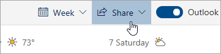

# Berbagi dengan Outlook di webSharing with Outlook on the web

1. Di bagian bawah halaman, pilih kalender untuk membuka kalender.At the bottom of the page, select Calendar to go to Calendar.

2. Di kalender, pada toolbar di bagian atas halaman, pilih **bagikan**, dan pilih kalender yang ingin Anda bagikan.In Calendar, on the toolbar at the top of the page, select **Share**, and choose the calendar you want to share. 

    

    **Catatan**: Anda tidak dapat berbagi kalender yang dimiliki orang lain.**Note**: You can't share calendars owned by other people.

3. Masukkan nama atau alamat email orang yang ingin Anda bagikan kalender.Enter the name or email address of the person you want to share your calendar with.

4. Pilih bagaimana Anda ingin orang tersebut menggunakan kalender Anda:Choose how you want the person to use your calendar: 
    - **Dapat melihat saat saya sibuk**   memungkinkan mereka melihat ketika Anda sedang sibuk tetapi tidak menyertakan rincian seperti lokasi acara.**Can view when I'm busy** lets them see when you're busy but doesn't include details like the event location. 
    - **Dapat melihat judul dan lokasi**   memungkinkan mereka melihat ketika Anda sedang sibuk, serta judul dan lokasi acara.**Can view titles and locations** lets them see when you're busy, as well as the title and location of events. 
    - **Dapat melihat semua rincian**   memungkinkan mereka melihat semua rincian acara Anda.**Can view all details** lets them see all the details of your events. 
    - **Dapat mengedit**   memungkinkan mereka mengedit kalender Anda.**Can edit** lets them edit your calendar. 
    - **Mendelegasikan**   memungkinkan mereka mengedit kalender Anda dan membagikannya dengan orang lain.**Delegate** lets them edit your calendar and share it with others.

5. Pilih **bagikan**.Select **Share**. Jika Anda memutuskan untuk tidak berbagi kalender saat ini, pilih **Hapus**.If you decide not to share your calendar right now, select **Remove**. 

**Catatan**:**Notes**:  

- Saat berbagi kalender dengan seseorang yang tidak menggunakan Outlook di web, misalnya, seseorang yang menggunakan Gmail, mereka hanya akan dapat menerima undangan menggunakan Microsoft 365 atau akun Outlook.com.When sharing your calendar with someone who's not using Outlook on the web, for example, someone using Gmail, they'll only be able to accept the invitation using a Microsoft 365 or an Outlook.com account. 

- Kalender ICS hanya dapat dibaca, jadi meskipun Anda memberikan akses Edit kepada orang lain, kalender tersebut tidak dapat diedit.ICS calendars are read-only, so even if you grant edit access to other people, they won't be able to edit your calendar. 

- Seberapa sering sinkronisasi kalender ICS Anda bergantung pada penyedia email orang yang Anda bagikan.How often your ICS calendar syncs depends on the email provider of the person you've shared it with. 

- Item kalender yang ditandai sebagai pribadi dilindungi.Calendar items marked private are protected. Sebagian besar orang yang Anda bagikan kalender dengan hanya melihat waktu item ditandai sebagai pribadi, bukan judul, lokasi, atau detail lainnya.Most people you share your calendar with see only the time of items marked private, not the title, location, or other details. Seri berulang yang ditandai sebagai pribadi juga akan menunjukkan pola pengulangan.Recurring series marked as private will also show the recurrence pattern.
