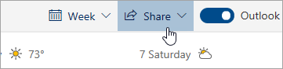

# Berbagi dengan Outlook di webSharing with Outlook on the web

Dari kalender, di toolbar di bagian atas halaman, pilih **bagikan**, lalu pilih kalender yang ingin Anda bagikan.From your Calendar, on the toolbar at the top of the page, select **Share**, and choose the calendar you want to share.

    

**Catatan**: Anda tidak dapat berbagi kalender yang dimiliki orang lain.**Note**: You can't share calendars owned by other people.

- Masukkan nama atau alamat email orang yang ingin Anda bagikan kalender.Enter the name or email address of the person you want to share your calendar with.
- Pilih bagaimana Anda ingin orang tersebut menggunakan kalender Anda:Choose how you want the person to use your calendar:
    - **Dapat melihat saat saya sibuk**   memungkinkan mereka melihat ketika Anda sedang sibuk tetapi tidak menyertakan rincian seperti lokasi acara.**Can view when I'm busy** lets them see when you're busy but doesn't include details like the event location.
    - **Dapat melihat judul dan lokasi**   memungkinkan mereka melihat ketika Anda sedang sibuk, serta judul dan lokasi acara.**Can view titles and locations** lets them see when you're busy, as well as the title and location of events.
    - **Dapat melihat semua rincian**   memungkinkan mereka melihat semua rincian acara Anda.**Can view all details** lets them see all the details of your events.
    - **Dapat mengedit**   memungkinkan mereka mengedit kalender Anda.**Can edit** lets them edit your calendar.
    - **Mendelegasikan**   memungkinkan mereka mengedit kalender Anda dan membagikannya dengan orang lain.**Delegate** lets them edit your calendar and share it with others.
- Pilih **bagikan**.Select **Share**.
