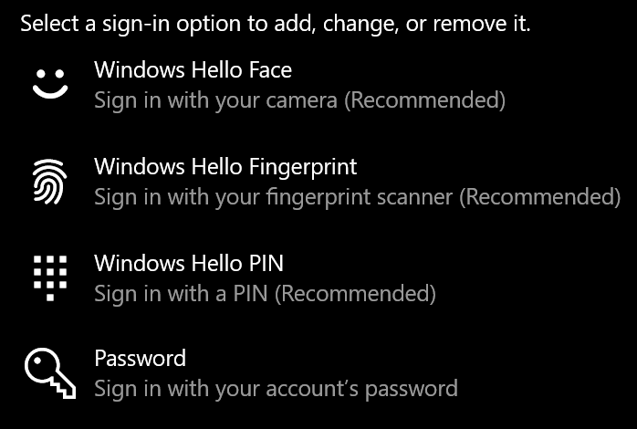
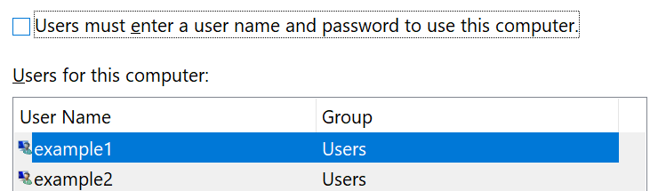

# Masuk ke Windows 10 tanpa menggunakan kata sandi

Untuk menghindari harus mengetikkan kata sandi pada startup Windows, kami menyarankan Anda menggunakan salah satu opsi masuk aman Windows Hello, seperti PIN, pengenalan wajah, atau sidik jari, jika tersedia. Jika Anda benar-benar ingin menonaktifkan akses masuk yang aman, lihat instruksi "Masuk secara otomatis ke Windows 10" di bawah ini.

**Mengamankan alternatif Windows Hello dengan kata sandi akun**

Masuk ke **Pengaturan > Akun > opsi Masuk (atau** klik di [sini](ms-settings:signinoptions?activationSource=GetHelp)). Opsi masuk yang tersedia akan dicantumkan. Misalnya:

Klik atau ketuk salah satu opsi untuk mengonfigurasinya. Saat berikutnya Anda memulai atau membuka kunci Windows, Anda akan bisa menggunakan opsi baru sebagai ganti kata sandi. 

**Masuk ke Windows 10 secara otomatis**

**Catatan**: Masuk otomatis mudah, tetapi menghadirkan risiko keamanan, terutama jika PC Anda dapat diakses oleh beberapa orang. 

1. Klik atau ketuk **tombol** Mulai di Taskbar.

2. Ketik **netplwiz** dan tekan tombol Enter untuk membuka jendela Akun Pengguna.

3. Di **Akun Pengguna,** klik akun yang ingin Anda masuki secara otomatis saat Windows dimulai.

4. Kosongkan kotak centang "Pengguna harus memasukkan nama pengguna dan kata sandi untuk menggunakan komputer ini".

    

5. Klik **OK**. Anda akan diminta untuk memasukkan dan mengonfirmasi kata sandi untuk akun yang dipilih. Klik **OK** untuk menyelesaikannya. Di waktu berikutnya Windows 10 dimulai, Windows 10 akan masuk secara otomatis ke akun yang Anda pilih.
