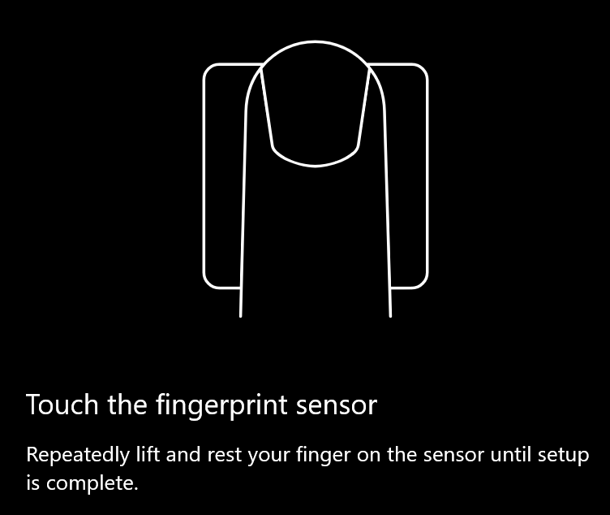
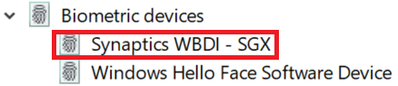

# Menggunakan opsi Unlock Fingerprint di Windows 10

**Mengaktifkan sidik jari Windows Hello**

Untuk membuka kunci Windows 10 menggunakan sidik jari, Anda perlu menyetel sidik jari Windows Hello dengan menambahkan (membiarkan jendela mempelajari cara mengenali) setidaknya satu jari. 

1. Masuk ke **pengaturan > akun > opsi masuk** (atau klik [di sini](ms-settings:signinoptions?activationSource=GetHelp)). Opsi masuk yang tersedia akan dicantumkan. Misalnya:

    

2. Klik atau ketuk **sidik jari Windows Hello**, lalu klik **Siapkan**. Di jendela penyetelan Windows Hello, klik **mulai**. Sensor sidik jari akan aktif, dan Anda akan diminta untuk meletakkan jari Anda pada sensor:

   

3. Ikuti instruksi, yang akan meminta Anda untuk berulang kali memindai jari Anda. Setelah selesai, Anda akan memiliki opsi untuk menambahkan jari lain yang mungkin ingin Anda gunakan untuk masuk. Saat berikutnya Anda masuk ke Windows 10, Anda akan memiliki opsi untuk menggunakan sidik jari Anda untuk melakukannya.

**Sidik jari Windows Hello tidak tersedia sebagai Opsi masuk**

Jika sidik jari Windows Hello tidak diperlihatkan sebagai Opsi **masuk**, artinya Windows tidak mengetahui pembaca/pemindai sidik jari apa pun yang MELEKAT pada PC Anda, atau bahwa kebijakan sistem mencegah penggunaannya (jika misalnya PC dikelola oleh tempat kerja Anda). Untuk memecahkan masalah: 

1. Pilih tombol **mulai** di taskbar dan Cari **manajer perangkat**.

2. Klik atau ketuk untuk membuka **manajer perangkat**.

3. Di manajer perangkat, Perluas perangkat biometrik dengan mengklik Chevron.

   

4. Pemindai sidik jari Anda harus dicantumkan sebagai perangkat biometrik, seperti pemindai Synaptics WBDI:

   

5. Jika pemindai sidik jari tidak diperlihatkan, dan pemindai diintegrasikan ke PC Anda, buka situs web produsen PC. Di bagian dukungan teknis untuk model PC Anda, Cari Driver Windows 10 untuk pemindai yang bisa Anda instal.

6. Jika pemindai terpisah dari PC (dilampirkan melalui USB), buka situs web pabrikan pemindai untuk menemukan dan menginstal perangkat lunak driver perangkat Windows 10 untuk model pemindai yang Anda miliki.
