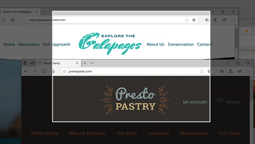
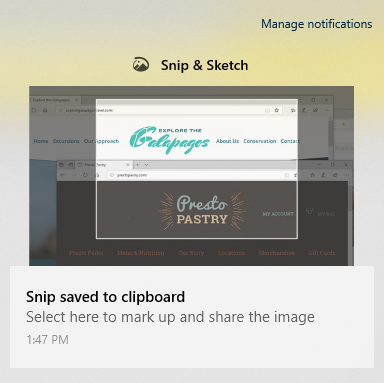

# Gunakan Potongan & Sketsa untuk mengambil gambar, menandai, dan berbagi gambar

Sketsa layar kini disebut **Potongan & Sketsa.** **Untuk mengambil potongan cepat**:

1. Tekan tombol **logo Windows + Shift + S**. Anda akan melihat layar tampak gelap dan kursor ditampilkan sebagai silang. 

2. Pilih sebuah titik di tepi area yang ingin Anda salin dan klik kiri kursor. 

3. Pindahkan kursor Anda untuk menyoroti area yang ingin Anda rekam. Area yang Anda ambil gambarnya akan muncul di layar Anda.

   

Gambar yang dipotong disimpan ke clipboard, siap untuk disisipkan ke email atau dokumen. 

**Jika Anda ingin mengedit atau menampilkan gambar:** 

- Klik ikon pemberitahuan di sisi kanan taskbar; lalu klik gambar yang baru saja Anda ambil gambarnya. Potongan layar akan terbuka di aplikasi & Sketsa Potongan.

   
