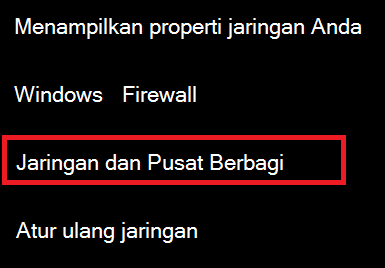
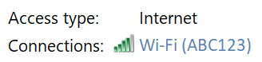
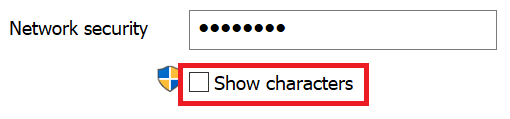

# Menampilkan Wi-Fi sandi jaringan di Windows 10

1. Pastikan PC Windows 10 Anda tersambung ke Wi-Fi jaringan.

2. Masuk ke **Pengaturan > Jaringan & Internet >,** atau klik atau  ketuk di sini untuk memungkinkan kami membawa Anda ke sana sekarang.)

3. Klik **Jaringan dan Pusat Berbagi.**

    

4. Di **Pusat Jaringan dan Berbagi,** di samping **Koneksi**, Anda akan melihat nama jaringan nirkabel Anda. Misalnya, jika jaringan Anda bernama "ABC123," Anda mungkin melihat:

    

    Klik nama jaringan nirkabel untuk membuka Wi-Fi Status Nirkabel. 

5. Di jendela Wi-Fi Status, klik **Properti Nirkabel,** klik tab **Keamanan,** dan centang **Perlihatkan karakter.**

    

